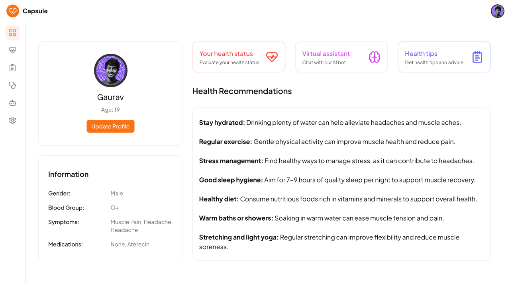

# 🩺 Capsule - Your Personal AI Health Assistant



## 🌟 Introduction

Capsule is a cutting-edge AI-powered health assistant designed to help you monitor and manage your well-being. Built with Next.js, Clerk, Stripe, Prisma, and MongoDB, Capsule provides real-time insights and personalized recommendations to keep you on top of your health.

## 🚀 Features

- **Real-time Health Monitoring:** Track your symptoms, medications, and overall wellness in one place.
- **AI-Powered Chat:** Get instant answers and health tips from your AI assistant.
- **Premium Features:** Unlock additional tools and functionalities with a one-time payment of $9.
- **Seamless Integration:** Built with modern tech stack for smooth performance and scalability.

## 🔗 Live Preview

Check out the live demo of Capsule here: [Live Preview](http://capsule.vercel.app) <!-- Replace with your actual live preview link -->


## 💻 Tech Stack

- Tailwind CSS
- Shadcn UI
- Headless UI
- Clerk
- Tanstack Query
- Framer Motion
- Stripe
- Zustand
- Zod
- Gemini API
- Prisma
- MongoDB

## 🛠️ Installation

To run Capsule locally, follow these steps:

1. Clone the repository:
   ```bash
   git clone https://github.com/gauravmandall/capsule.git
   ```
2. Install dependencies:
   ```bash
   pnpm install
   ```
3. Set up environment variables in a `.env` file:

   ```
   # app
   NEXT_PUBLIC_APP_NAME=
   NEXT_PUBLIC_APP_URL=

   # database
   DATABASE_URL=

   # clerk
   NEXT_PUBLIC_CLERK_PUBLISHABLE_KEY=
   CLERK_SECRET_KEY=

   # google
   NEXT_PUBLIC_GOOGLE_API_KEY=

   # stripe
   STRIPE_SECRET_KEY=
   NEXT_PUBLIC_STRIPE_PUBLISHABLE_KEY=
   STRIPE_WEBHOOK_SECRET=
   ```

4. Push the Prisma schema:
   ```bash
   pnpm dlx prisma db push
   ```
5. Run the development server:
   ```bash
   pnpm dev
   ```

## ☕ Buy Me a Coffee

If you enjoy using caps.ai, consider supporting my work!
[Buy Me a Coffee ☕](https://buymeacoffee.com/gauravmandall)

## 📜 License

This project is licensed under the MIT License. See the [LICENSE](LICENSE) file for details.

## 💬 Contact

If you have any questions or feedback, feel free to reach out via [GitHub Issues](https://github.com/Gauravmandall/capsule/issues).

---

Built with ❤️ by [Gaurav](https://github.com/gauravmandall)
